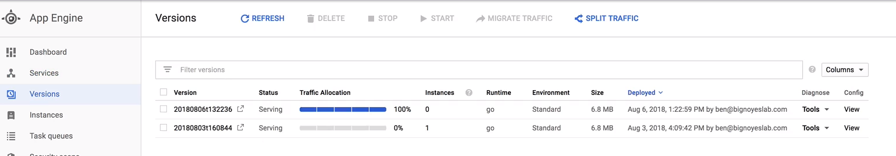

# Managing App Engine

App engine is a platform as a service - means it's a managed platform

Running a project on app engine:
* How to split traffic
    * How we want to distribute web requests
        * Shifting requests to different versions 
        * AB testing 
* How to manage scaling 

# Splitting Traffic

If we make a change to the below CSS file and say change the colour of the background in the Header section 
[frontend/app/public/assets/css/main.css](../../content-google-cloud-engineer-master/frontend/app/public/assets/css/main.css)  

We then deploy the application with the changes:  
[frontend/cloud/deploy.sh](../../content-google-cloud-engineer-master/frontend/cloud/deploy.sh)  
This will then run the `gcloud app deploy` command, there will now be two version of the service 

* The deployment will recognise that only one file has changed so it only uploads that file
* Default behaviour of the gcloud app deploy command - routes 100% of the traffic to the newly uploaded version 
* To prevent this you use a flag `--no-promote`

This can be seen in the google console as well as having 2 versions of the default service:

## Split traffic between the two versions 50/50

`gcloud app versions list` - list all versions for the service  
`gcloud app services set-traffic <service_name> --split=<version_id>=.5,<version_id>=.5 --split-by=random` - splits traffic of a service by version  
Traffic should now be split by two instances randomly

There are other types of splitting - the default used without the `--split-by` flag  is by IP-address:
* IP-address splitting: fingerprint of the IP-address from the request and divides the requests evenly by it
    * same people requesting will always get the same version
* Cookie based splitting: setting a cookie called goog_app_uid and setting a random number 0-999, then splits traffic based on that value
* Random: No persistence mechanisms
    * same person could bounce across different versions with each page load 

Uses:
* AB - testing: See which users respond better to which version 
* Canary testing: introduce a new version to a small group of users and then monitor for errors
* Rollback mechanism - use traffic splitting to send 100% of the traffic to a previous non broken version 

`gcloud app versions delete <version_id>` - delete a version no longer needed/broken 

# Scaling 
By default - if no scaling option is listed in the app.yml file, then it will use automatic functionality.  
App engine has 3 types of scaling:
* **Automatic**
    * Create instances dynamically bases on factors to scale dynamically
        * request rate
        * response
        * latency
        * Instance metrics
    * also customisable ;
        * target cpu util for to have new instance startup
        * max concurrent request rate is high
        * min/max idle instances - accomadate burst traffic - ready to serve a sudden upsurge (but expensive)
* **Manual**
    * Have to setup parameters 
        * Service
        * runtime
        * api_version
        * instance_class
            * \# of instances
* **Basic**
    * standard environment only can use basic
    * can adjust max number of instances in app.yml

Uses:

* Standard environments all 3 
* flexible envrionments can only use automatic or manual