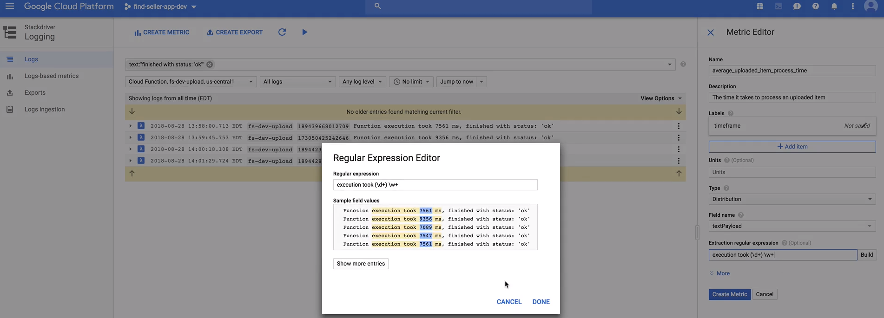

# Monitoring and Logging - Stackdriver

* Alerts
* Custom metrics
* Log sinks
* Logs 

## Alerts
Useful to find issues before they become a problem. GCP tracks a lot of different metrics:
* For compute engine, this could be disk usage, network traffic, incoming and outgoing CPU usage
* PubSub, how many messages published, how many queued, how many errors
* Each service has its own metrics

### Alert for pubsub messages not being processed
Within stackdriver you can add an alerting policy - this consists of:

* one or more conditions
    * metrics we want to watch. threshold, metric absence, rate of change etc
    * e.g. pushed pubsun messages not successfully processed 
* notifications
    * Email, pager, sms, hipchat, slack and custom webhooks
* optional documentation
    * will be sent along with the notification 
* policy name

When we run workloads on compute engine instances, stackdriver can be used to monitor and log data from the instances by
* Installing stackdrive for monitoring and logging agents onto an instance (agents that support a ton of metrics (cassandra, hbase, mysql, nginx etc)
* This enables us to create alerts based on the services we are running in our instances

### Creating custom metrics
* Custom Monitoring Metric: 
    * monitoring some service application on a specific thing. You populate that metric with code and its running. As long as you have access to project your code can call to update that metric
    * Can be created in python using the googl.cloud monitoringv3 library, you then populate it by setting the value 
    * starts with custom.googleapi.com

* Custom Logging Metric:
    * Allows us to filter the logs, extract some data from the results and save as our metric 
    * e.g. a logging metric that extracts time to run cloud function, filter results for only cloud function
        * You can then filter the results say that only finish with status="OK"
    * you can create a metric based on the execution time in the logs
    * starts with logging.googleapis.com

Now if records come in that match the filter then the value is saved 

## Log Sinks
Log sinks are a way to export specific log records - click create export on console to create an export

* Create filters and create a sink based off the filters
* This sink is then exported to bq, cloud storage, pubsub etc
    * say for bq triggering an event will create a record in a cloudaudit table which will be informed to user, for query
* This is NOT a real time export - each destination has its own timeframe of refresh

* Log sinks are useful for sending logs to other services - ensure we have a history of change made to the platform, not just per service 

## Logs
Stackdriver logs has many filters that can be used to see logs say for different services and track specific events 
* You can select different payload filters, e.g text payload, or JSON payload to filter
    * e.g. `jsonPayload.reporter:SRC ` filters all payloads where reporter key is set to SRC
* stackdriver also has different operators you can use such as greater than or less than etc to focus on different pools of log data

