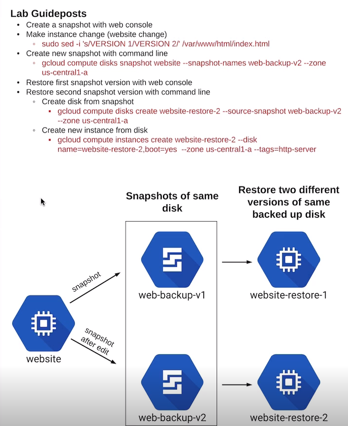

# Working with Snapshots on Google Compute Engine

[[TOC]]

# Outline of the lab's objectives

# Methodology

## Create snapshot using web console.

* Go to the top-left menu > Compute Engine > Snapshots
* Click Create snapshot
* Name snapshot "web-backup-v1"
* In Source Disk dropdown menu, select Website
* Click Create

## Make instance change - update website to VERSION 2.
* Connect to the website instance using SSH from the Compute Engine web console
* Enter the following command to replace index page with 'VERSION 2' instead of 'VERSION 1':  
`sudo sed -i 's/VERSION 1/VERSION 2/' /var/www/html/index.html` - sed - find and replace in bash, -i: inplace edit
* Exit SSH session

Reloading the page will now show version 2 instead of version 1 before

## Create new snapshot from same instance using command line.
* Open Cloud Shell and enter following command:  
`gcloud compute disks snapshot website --snapshot-names web-backup-v2 --zone us-central1-a`
* Verify snapshots using web console and Cloud Shell. Notice the size of the second snapshot compared to first:  
`gcloud compute snapshots list`  
`gcloud compute snapshots describe web-backup-v2`

The second snapshot from the CLI has now been created as seen above. Note that the size is only 8MB compared to the 554MB of the first snapshot
* Remember that snapshots work on an incremental backup method, subsequent backups only capture the delta from the previous snapshot

## Restore first snapshot using web console in new zone.
* Go to top left menu > Compute Engine
* Click CREATE INSTANCE
* Name instance "website-restore-1"
* Choose a region/zone
* Change boot disk:
    * Select Snapshots
    * Select web-backup-v1
    * Click Select at the bottom
* Select box to allow HTTP traffic
* Click Create

Now there are two VM instances, the original (v2) and the instance booted from the version one snapshot (v1)

## Restore second snapshot using command line

Doing the same thing via CLI is a two step process - the console step does it all in one go for you, this is what really happens

* Navigate to Cloud Shell
* Create disk from snapshot:  
`gcloud compute disks create website-restore-2 --source-snapshot web-backup-v2 --zone us-central1-a`
* Create new instance from disk:  
 `gcloud compute instances create website-restore-2 --disk name=website-restore-2,boot=yes --zone us-central1-a --tags=http-server`  
Note that the zone has to be the same as where the disk is 