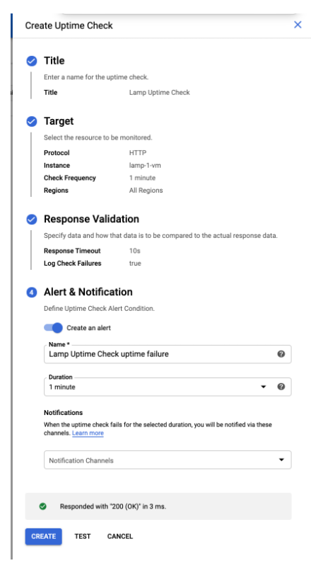
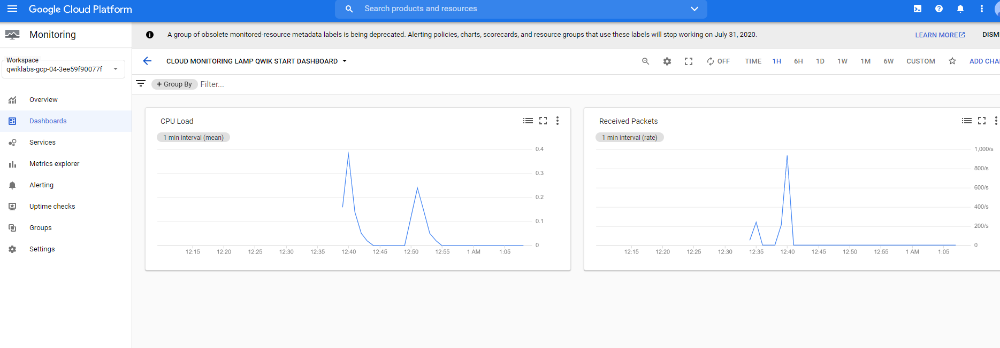
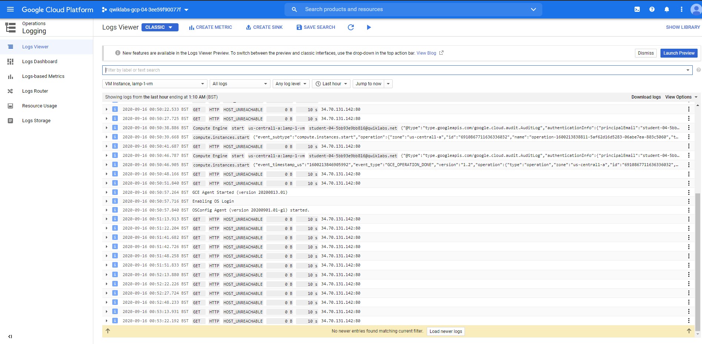

# Cloud Monitoring

This is essentially a new platform that Google has recently added that integrates stackdriver nicely with everything else in a new tab called google operations in the console

```text
Cloud Monitoring provides visibility into the performance, uptime, and overall health of cloud-powered applications. Cloud Monitoring collects metrics, events, and metadata from Google Cloud, Amazon Web Services, hosted uptime probes, application instrumentation, and a variety of common application components including Cassandra, Nginx, Apache Web Server, Elasticsearch, and many others. Cloud Monitoring ingests that data and generates insights via dashboards, charts, and alerts. Cloud Monitoring alerting helps you collaborate by integrating with Slack, PagerDuty, HipChat, Campfire, and more.
```

Your project will have a monitoring workspace that will be created when you click into the monitoring tab on  the console menu.  
To enable logging and streaming from your created VM instances - you can install the cloud monitoring and logging agents on the VM instance

* Monitoring Agent:
    * `curl -sSO https://dl.google.com/cloudagents/add-monitoring-agent-repo.sh`
    * `sudo bash add-monitoring-agent-repo.sh`
    * `sudo apt-get update`
    * `sudo apt-get install stackdriver-agent` - Basically just the stack driver agent from before
* Logging Agent:
    * `curl -sSO https://dl.google.com/cloudagents/add-logging-agent-repo.sh`
    * `sudo bash add-logging-agent-repo.sh`
    * `sudo apt-get update`
    * `sudo apt-get install google-fluentd`

## Uptime checks



Uptime checks verify that a resource is always accessible

* It can verify using the HTTP protocol - so make sure your VM instance firewall settings are set to accept http requests

## Alerting Policies

Alerting Policies can be used to alert you of different things that might happen within an instance depending on your set conditionals.

* You can create a policy that will look at your traffic inbound and alert you if its greater than a threshold
* There are different notification channels you can use to be alerted - email, sms,  slack hipchat etc


## Dashboards
You can create your own custome dashboards in the monitoring workspace to view the thigns only you want to see



## Logs and streaming them

In the console, selecting logging/logs_viewer is basically the old stackdriver interface you are used to

Here you can filter by resource type you want to audit, and stream them live 


