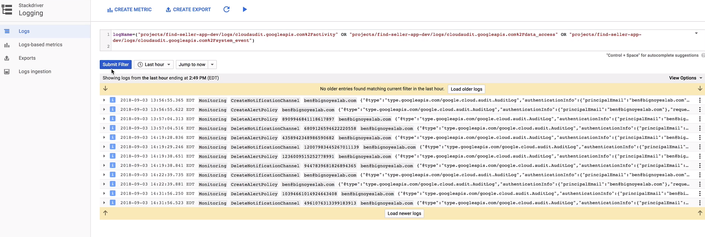

# Viewing Audit Logs for Project and Managed Services

It is important to view who is making what changes to the project  
* On the console there is the activity view, similar to the log view
* Able to filter based on resource type used, user, categories e.g. filter out all K8s logs 

## A better way to is to use the log viewer

* Click on stackdriver, Logging on the console
* Using the basic drop down filter you can select Audited Resource

 

The dropdown filters give us a good template to have a custom advanced log filter shown above in the second image, we then edit it quickly as seen so that it means: show all logs where the log is called activity, data access or system

# We can also use the CLI to view audit logs
Using the `gcloud logging read` command:  
`gcloud logging read <"'advanced filter string' and severity != ERROR>"--limit 12`
